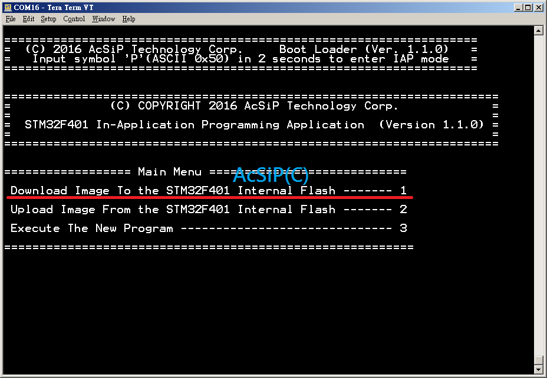

# UART IAP
This page describe how to update application firmware by UART2.  

<B>0. Use TeraTerm to open the console.</B> 

<B>1. Reset target device to lunch the boot loader.</B> 

<B>2. Input 'P' to lunch the boot loader main menu.</B> 

<B>3. Input '1', Let boot loader wait for receiving binary file for upgrade.</B> 

<B>4. Use TeraTerm to send the firmware file with YModem.</B> 

<B>5. Wait for file transmission complete.</B> 
If it fails, Back to step 1 and retry again. 

<B>6. Wait for firmware update complete.</B> 

<B>7. Reset target device. Let new firmware working......</B> 

 
 
 
Refer to: 
[AN4567](https://my.st.com/resource/en/application_note/dm00161366.pdf  "https://my.st.com/resource/en/application_note/dm00161366.pdf")
